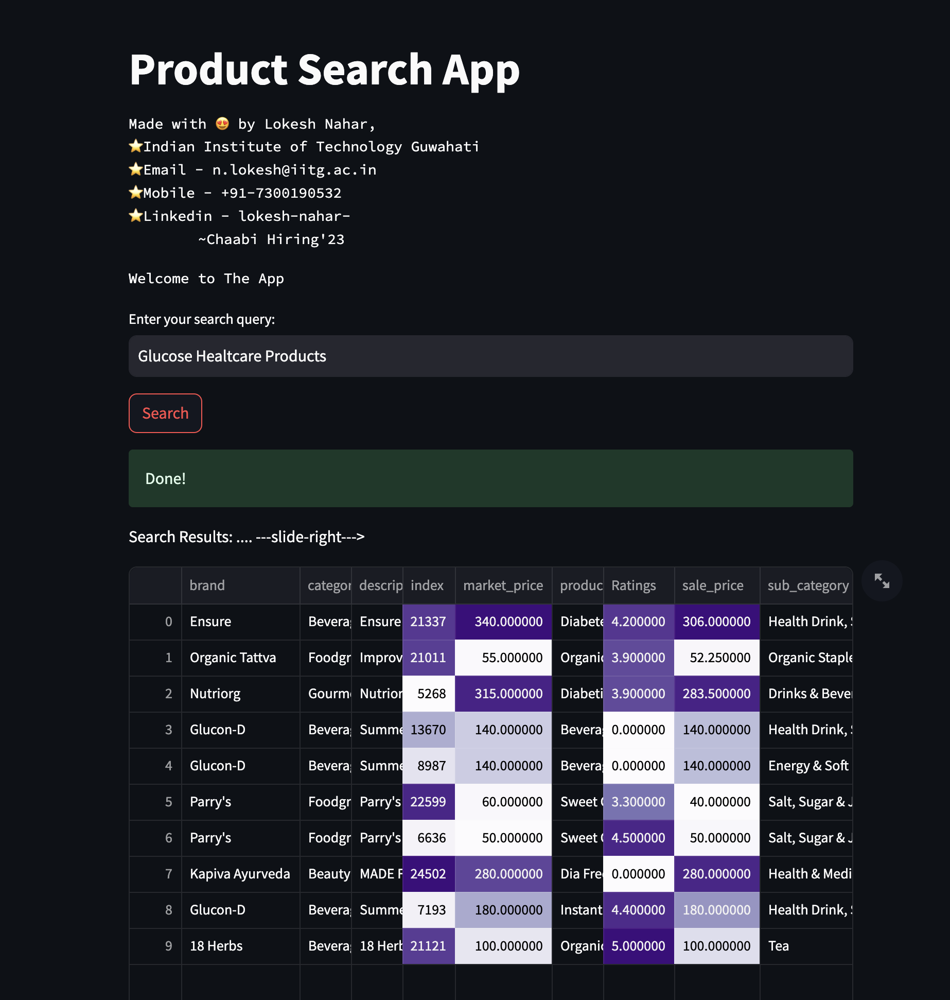
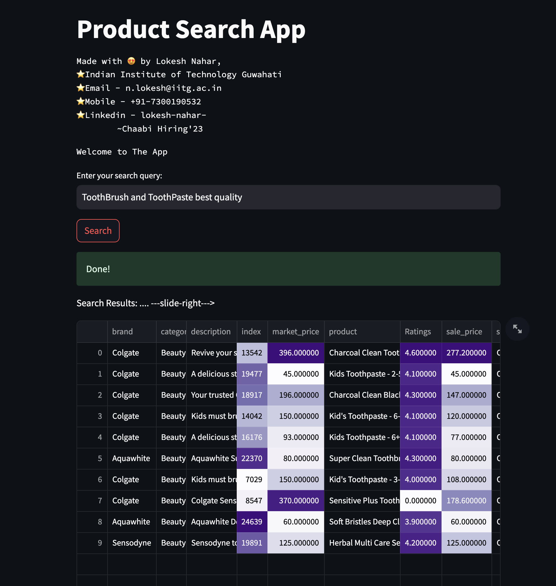
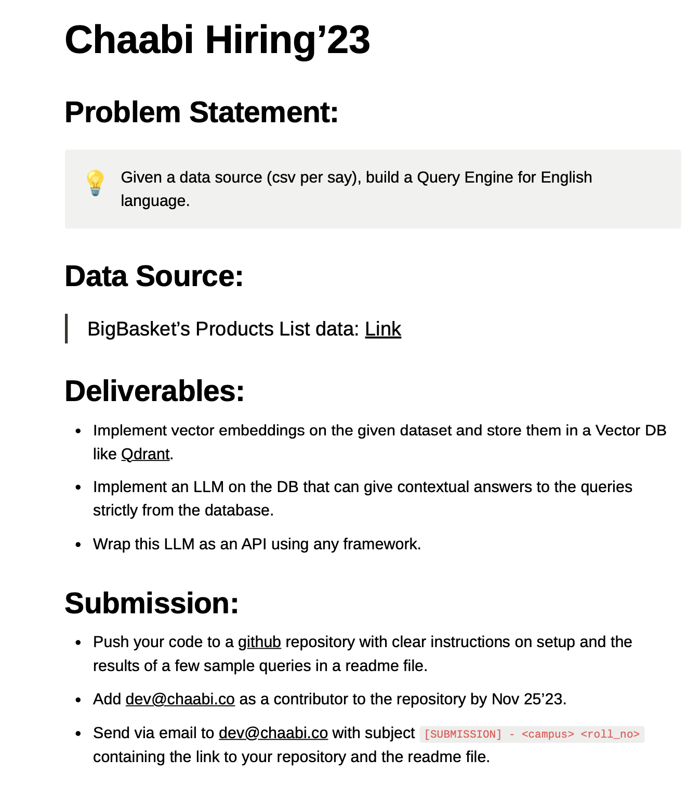

# Query Engine


**Qdrant + LLM + FastAPI + Streamlit**


# Requirements
Make sure you are using Python 3.X in your environment.\
Install the required dependencies using the following command:
```
pip3 install -r requirements.txt
```
Dependencies:
* [Docker](https://docs.docker.com/get-docker/)
* Sentence-Transformers (all-MiniLM-L6-v2) [Among the pre-trained models](https://www.sbert.net/docs/pretrained_models.html)
* [Qdrant-Vector-DataBase](https://qdrant.tech/)
* [FastAPI](https://fastapi.tiangolo.com/)
* [Streamlit](https://streamlit.io/)
* Pandas, Numpy, Requests
  


# #Start


## 1. Start the Qdrant service
 1.1 Download the latest Qdrant image from Dockerhub:

```
docker pull qdrant/qdrant
```


 1.2 Run the qdrant service (make sure port 6333 is available):

```
docker run -p 6333:6333 -v $(pwd)/qdrant_storage:/qdrant/storage:z qdrant/qdrant
```
->Under the default configuration, all data will be stored in the ./qdrant_storage directory.

->Qdrant is now accessible: 
  API: localhost:6333


**For the next steps make sure your current directory is 'src' or navigate to it with the following command:**
```
cd src
```

***[UPDATE] Note: To use the Cloud Qdrant Database simply uncomment the variables Qdrant-URL and Qdrant-API-Key in config.py and proceed to step number 3***


## 2. Preprocess data, Generate the vector Embeddings and upload them to the Qdrant Database

2.1 Run the following command to generate the embeddings from the given dataset and simultaneously upload to the database (make sure your system has GPU and confirm the Data Path in the config.py file):
```
python3 uploader.py --generate_embeddings
```
Note: The Embeddings are being generated using the "all-MiniLM-L6-v2" model, however, if your machine's GPU resources permit, you may also use the "bert-base-uncased" model to generate the embeddings and store them in the .npy file, simply change the argument to "--generate_bert_embeddings", but make sure you install Tensorflow & transformers dependencies (included in requirements.txt).


2.2 if the embeddings are already saved (bb_chaabi_vectors.npy) in a npy file, just upload them to the qdrant database
```
python3 uploader.py
```
-> This will upload the vector embeddings and payload (additional information along with vectors to display search results) in the qdrant database.


## 3. Load the API service
In order to start the Fast API service, run the service.py file using the below command in a separate terminal:
```
uvicorn service:app --reload  
```
-> You may now navigate to [http://127.0.0.1:8000/docs](http://127.0.0.1:8000/docs) to access fastAPI interactive API documentation to search in a query


## 4. Start the Frontend application.
Finally, start our interactive frontend web app; run the following command in a split terminal:
```
streamlit run app.py
```
-> The app will automatically start, The Local URL and network URL are displayed in the terminal you can access it from the links as well.


**Simply type in the query in the text box and press the search button.**

Dataset used is [Big-Basket-Products-Dataset](https://chaabiv2.s3.ap-south-1.amazonaws.com/hiring/bigBasketProducts.csv)

Here are some Search results:
* .
 

* .
 
***Special Thanks to Chaabi for giving the Problem Statement***



***In the symphony of growth, knowledge is the key, and experience the gentle notes that compose our unique melody.***
